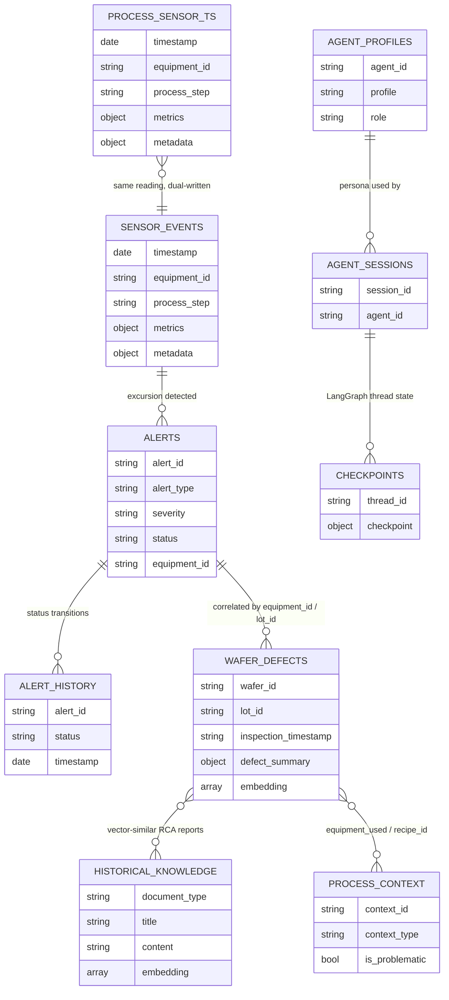

# EDD — Entity Document Diagram

Database: `smf-yield-defect` (Atlas, configured via `MONGODB_URI`; database name overridable
via `MDB_DATABASE_NAME` / `DATABASE_NAME`, both defaulting to `smf-yield-defect` — see
`backend/config/config.json` and `.env.example`).

This application defines no JSON Schema validators. Field types below were derived from
`backend/db/mdb.py`, the collection creators in `backend/scripts/`, the write paths in
`backend/services/`, and the seeded sample documents in
`backend/data_generation/sample_data/*.json`.

## Entity overview

| Collection | Type | Written by | Read by | Search / vector index |
| --- | --- | --- | --- | --- |
| `process_sensor_ts` | Time series (`timeField: timestamp`, `minutes` granularity) | `services/sensor_data_writer.py` | `routers/sensors.py`, `routers/websockets.py`, `services/sensor_cleanup_service.py` | — |
| `sensor_events` | Document | `services/sensor_data_writer.py` | `services/excursion_detector.py` (Change Streams), `routers/sensors.py` | — |
| `wafer_defects` | Document | `services/wafer_generator.py`, `backend/scripts/load_wafer_defects_and_embed.py` | `routers/wafers.py`, `routers/websockets.py`, `services/embedding_pipeline.py`, `services/unified_search_service.py` | Vector: `wafer_defects_vector_search` on `embedding` (1024-dim, cosine). Text: `wafer_defects_text_index` (dynamic) |
| `historical_knowledge` | Document | `backend/scripts/load_historical_knowledge.py`, `services/alert_manager.py` | `services/unified_search_service.py`, `services/rca_chat_tools.py` | Vector: `historical_knowledge_vector_search` on `embedding` (1024-dim, cosine). Text: `historical_knowledge_text_index` (dynamic) |
| `process_context` | Document | `backend/data_generation/generate_process_context.py` | `services/rca_chat_tools.py`, `services/unified_search_service.py` | — |
| `alerts` | Document | `services/alert_manager.py` (via `services/excursion_detector.py`) | `routers/alerts.py`, `routers/wafers.py`, `services/monitoring_service.py` | — |
| `alert_history` | Document | `services/alert_manager.py` | `services/alert_manager.py` (audit trail) | — |
| `embedding_cache` | Document | `services/embedding_service.py` | `services/embedding_service.py` | — |
| `checkpoints`, `checkpoints_writes` | Document | LangGraph `langgraph-checkpoint-mongodb` `MongoDBSaver`, via `services/rca_chat_tools.py` / `routers/chat.py` | `routers/chat.py` | — |
| `agent_profiles` | Document | seeded from `backend/config/config.json` (`DEFAULT_AGENT_PROFILE`) | `services/rca_chat_tools.py` | — |
| `agent_sessions` | Document | `services/rca_chat_tools.py` / `routers/chat.py` | `routers/chat.py` | — |
| `logs` | Document | application logging path (`MDB_LOGS_COLLECTION`) | — | — |

Collection names are configured in `backend/config/config.json` (`MDB_TIMESERIES_COLLECTION`,
`MDB_EMBEDDINGS_COLLECTION`, `MDB_HISTORICAL_RECOMMENDATIONS_COLLECTION`,
`MDB_PROCESS_CONTEXT_COLLECTION`, `MDB_CHAT_HISTORY_COLLECTION`,
`MDB_CHECKPOINTER_COLLECTION`, `MDB_LOGS_COLLECTION`, `MDB_AGENT_PROFILES_COLLECTION`,
`MDB_AGENT_SESSIONS_COLLECTION`), not hardcoded — `alerts`, `alert_history`, `sensor_events`,
and `embedding_cache` are hardcoded collection names in their respective service files.

## `process_sensor_ts`

Time series collection created by `backend/scripts/mdb_timeseries_coll_creator.py`
(`timeField="timestamp"`, `granularity="minutes"`), fed continuously by
`services/sensor_data_writer.py` with high-frequency equipment telemetry.

| Field | Type | Notes |
| --- | --- | --- |
| `timestamp` | date | Time series `timeField`; ascending index |
| `equipment_id` | string | e.g. `CMP_TOOL_01` |
| `process_step` | string | `CMP`, `ETCH`, `LITHO` |
| `metrics.particle_count` | int | |
| `metrics.rf_power` | int | |
| `metrics.chamber_pressure` | int | |
| `metrics.temperature` | int | |
| `metrics.flow_rate` | int | |
| `metadata.lot_id` | string | |
| `metadata.wafer_id` | string | |
| `metadata.recipe_id` | string | |
| `metadata.operator_id` | string | |

## `sensor_events`

Regular (non-time-series) collection written alongside `process_sensor_ts` by
`services/sensor_data_writer.py` specifically so `services/excursion_detector.py` can watch it
via **Change Streams** (time series collections have restrictions on change stream support).
Same field shape as `process_sensor_ts`.

## `wafer_defects`

Written when a defect is generated (`services/wafer_generator.py`) or backfilled/embedded via
`backend/scripts/load_wafer_defects_and_embed.py` / `services/embedding_pipeline.py`.
Indexes created by `backend/scripts/mdb_document_coll_creator.py`.

| Field | Type | Notes |
| --- | --- | --- |
| `_id` | ObjectId | |
| `wafer_id` | string | Unique index |
| `lot_id` | string | Indexed |
| `inspection_timestamp` | string (ISO-8601) | ⚠️ stored as string, not a BSON date; indexed ascending |
| `ink_map.thumbnail_base64` | string (base64 PNG) | ~150x150 preview |
| `ink_map.thumbnail_size` | string | e.g. `"150x150"` |
| `ink_map.format` | string | `"PNG"` |
| `ink_map.full_image_url` | string | `s3://` URI, requires `S3_BUCKET_URI` |
| `ink_map.full_image_size` | string | e.g. `"500x500"` |
| `defect_summary.total_dies` | int | |
| `defect_summary.failed_dies` | int | |
| `defect_summary.yield_percentage` | double | |
| `defect_summary.defect_pattern` | string | e.g. `random`, `edge`, `cluster`; indexed, also a vector-index filter field |
| `defect_summary.severity` | string | `low`/`medium`/`high`; indexed, also a vector-index filter field |
| `die_map` | array\<array\<int\>\> | per-die pass/fail grid |
| `defects` | array\<object\> | individual defect records |
| `description` | string | free text; text-indexed |
| `process_context.last_process_step` | string | |
| `process_context.equipment_used` | array\<string\> | compound-indexed with `inspection_timestamp` |
| `process_context.recipe_id` | string | |
| `process_context.slurry_batch` | string | |
| `process_context.clean_cycle` | int | |
| `process_context.hours_since_pm` | int | |
| `embedding` | array\<double\> len=1024 | Voyage AI `voyage-multimodal-3` |
| `embedding_model` | string | `"voyage-multimodal-3"` |
| `embedding_type` | string | `"multimodal"` |
| `embedding_updated_at` | date | |

Vector index `wafer_defects_vector_search` — created by
`backend/scripts/mdb_vector_search_idx_creator.py` (native `vectorSearch` type):

```json
{
  "name": "wafer_defects_vector_search",
  "type": "vectorSearch",
  "definition": {
    "fields": [
      { "path": "embedding", "type": "vector", "numDimensions": 1024, "similarity": "cosine" },
      { "path": "defect_summary.defect_pattern", "type": "filter" },
      { "path": "defect_summary.severity", "type": "filter" }
    ]
  }
}
```

Text index `wafer_defects_text_index` — dynamic mapping, created manually in Atlas (see README).

## `historical_knowledge`

RCA reports, troubleshooting guides, and process-context knowledge base articles, loaded by
`backend/scripts/load_historical_knowledge.py` and embedded via `services/embedding_pipeline.py`.
Indexes created by `backend/scripts/mdb_document_coll_creator.py`.

| Field | Type | Notes |
| --- | --- | --- |
| `_id` | string | Human-readable id, e.g. `"RCA Report_001"` — ⚠️ not an ObjectId |
| `document_type` | string | e.g. `"RCA Report"`; indexed |
| `title` | string | text-indexed |
| `incident_date` | string (ISO-8601) | |
| `created_date` | string (ISO-8601) | indexed ascending |
| `content` | string | text-indexed |
| `defect_pattern` | string | |
| `equipment_id` | string | |
| `embedding` | array\<double\> len=1024 | Voyage AI `voyage-multimodal-3` |
| `metadata.process_area` | string | indexed |
| `metadata.defect_type` | string | indexed |
| `metadata.severity` | string | indexed |
| `tags` | array\<string\> | indexed |

Vector index `historical_knowledge_vector_search` (same `vectorSearch` shape as
`wafer_defects_vector_search`, filtering on `document_type` and `process_area`) and text index
`historical_knowledge_text_index` are documented in the README but must be created manually in
the Atlas UI — no script in `backend/scripts/` creates them automatically (see Known
inconsistencies).

## `process_context`

Recipes, slurry batches, and equipment configuration context, generated by
`backend/data_generation/generate_process_context.py`.

| Field | Type | Notes |
| --- | --- | --- |
| `context_id` | string | Unique index |
| `context_type` | string | Indexed |
| `is_problematic` | bool | Indexed |
| `slurry_details.qc_status` | string | Compound-indexed with `context_type` |

## `alerts`

Created by `services/alert_manager.py` when `services/excursion_detector.py` detects a
threshold breach on `sensor_events`.

| Field | Type | Notes |
| --- | --- | --- |
| `alert_id` | string | Unique index |
| `alert_type` | string | `AlertType` enum |
| `severity` | string | `AlertSeverity` enum (`low`/`medium`/`high`/`critical`); indexed, compound with `status` |
| `status` | string | `AlertStatus` enum (`open`/`acknowledged`/`resolved`/`closed`); indexed |
| `equipment_id` | string | Indexed |

## `alert_history`

Audit trail of alert status transitions, indexed on `alert_id`, written by
`services/alert_manager.py`.

## `checkpoints` / `checkpoints_writes`

LangGraph `MongoDBSaver` checkpoint store (`langgraph-checkpoint-mongodb`) — short-term memory
for the RCA agent, keyed by `thread_id`. Managed entirely by the LangGraph library, not by
application code; `routers/chat.py` deletes documents from `checkpoints` directly when clearing
a conversation.

## `agent_profiles` / `agent_sessions`

`agent_profiles` holds the agent persona (seeded from `DEFAULT_AGENT_PROFILE` in
`backend/config/config.json`, keyed by `agent_id`, chosen via `AGENT_PROFILE_CHOSEN_ID`).
`agent_sessions` tracks per-conversation session metadata for the chat UI.

## `embedding_cache`

Cache of previously computed query embeddings, keyed implicitly by query text, managed by
`services/embedding_service.py` (size bounded by `EMBEDDING_CACHE_SIZE`).

## Relationships

All relationships are **logical only** — no foreign keys, no schema validators, no indexes
beyond what is listed above.



## Known inconsistencies

1. **Two competing vector-index definitions for the same collections.**
   `backend/scripts/mdb_vector_search_idx_creator.py` creates indexes using the modern
   `"type": "vectorSearch"` MongoDB Search index syntax (matches the README's manual setup
   instructions), but `backend/services/vector_index_manager.py` defines a second, unused set
   of indexes (`wafer_defects_vector_index`, `historical_knowledge_vector_index`,
   `alerts_vector_index`) using the deprecated `"type": "knnVector"` mapping syntax and
   different index names. `alerts_vector_index` in particular expects an `embedding` field on
   `alerts` documents that `services/alert_manager.py` never writes. If
   `vector_index_manager.py` is wired up in the future, reconcile the index names/definitions
   with `mdb_vector_search_idx_creator.py` and the README, or remove the dead module. Update
   this entry once resolved.
2. **`historical_knowledge` has no automated vector/text index creation script**, unlike
   `wafer_defects` (which has `mdb_vector_search_idx_creator.py`). The README instructs creating
   `historical_knowledge_vector_search` and `historical_knowledge_text_index` manually via the
   Atlas UI. Update this entry once a script covers it.
3. **`wafer_defects.inspection_timestamp` and `historical_knowledge.incident_date` /
   `created_date` are ISO-8601 strings, not BSON dates**, despite being range-queried and
   sorted. Range queries work lexicographically only because the format is fixed-width
   ISO-8601; anything that parses these fields as dates (e.g. via `EJSON`) must do so
   explicitly. Update this entry if these are migrated to native dates.
