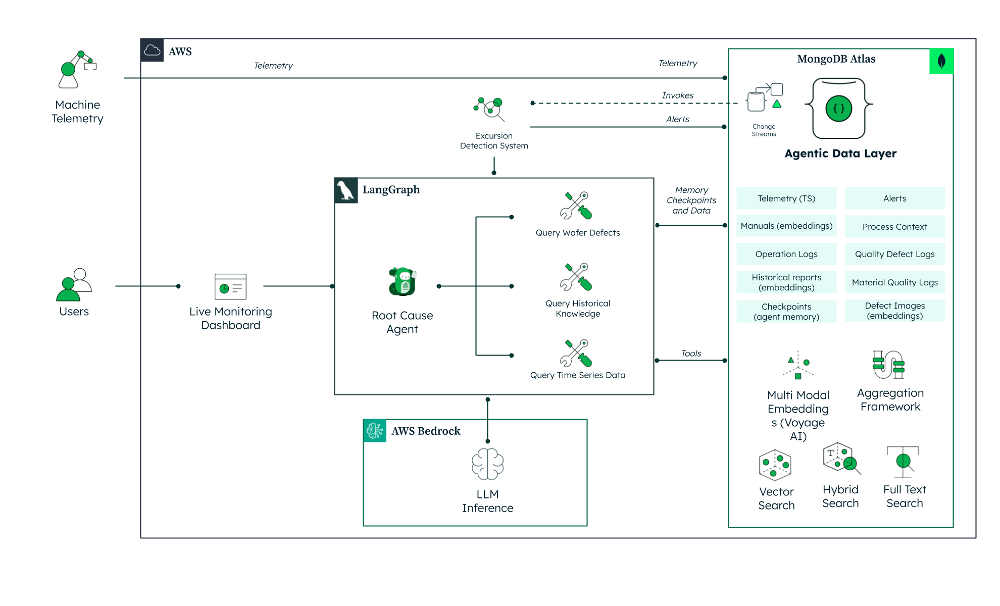
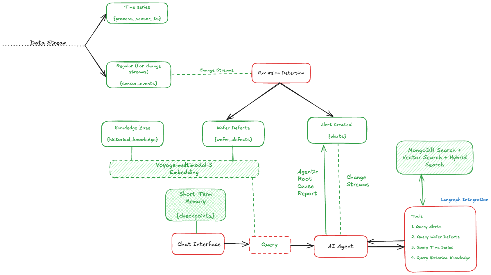
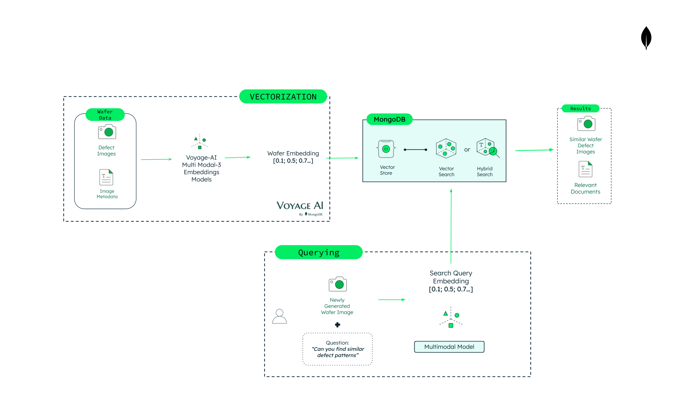
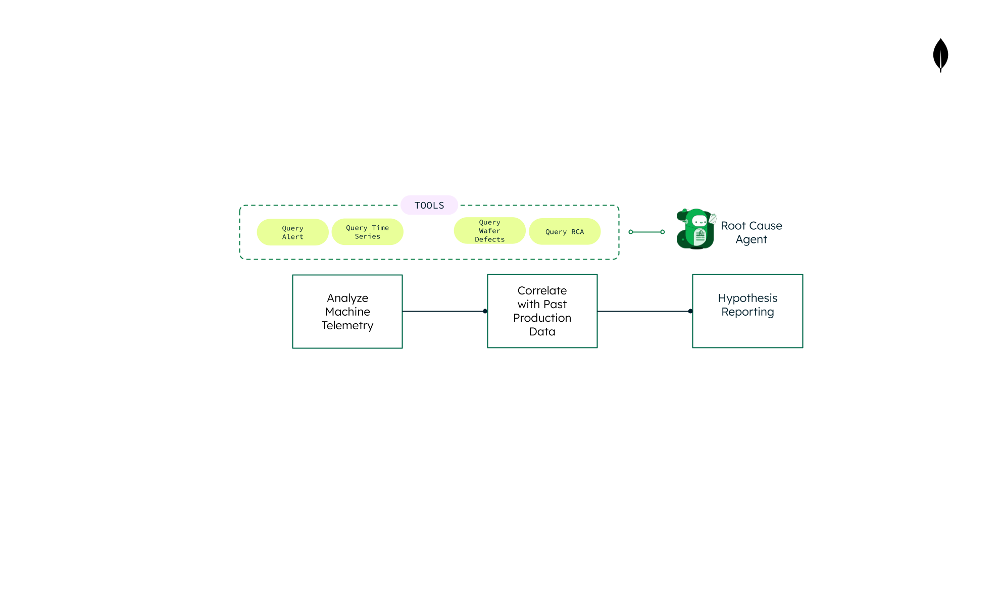

# Agentic Yield Analytics for Semiconductor Manufacturing

Demonstrates how MongoDB Atlas's unified data platform — combining time series, vector search, and document flexibility — powers real-time defect detection and AI-driven root cause analysis in semiconductor manufacturing, where yield loss costs the industry $50B+ annually.

## Where MongoDB Shines

- **Time Series Collections**: MongoDB's native time series collections store high-frequency sensor telemetry (particle counts, RF power, temperature) from CMP, ETCH, and LITHO equipment with automatic bucketing and efficient temporal queries — no separate time series database needed.
- **Change Streams for Real-Time Detection**: The Excursion Detector uses MongoDB Change Streams to monitor incoming sensor data in real time. When readings breach configurable thresholds, alerts fire within seconds — replacing batch jobs that traditionally take hours.
- **Atlas Vector Search for Defect Matching**: Multimodal embeddings from Voyage AI encode both wafer defect images and text descriptions into a shared vector space. Atlas Vector Search finds similar historical defects by visual pattern, enabling "show me defects that look like this" queries without a separate vector database.
- **Atlas Search for Knowledge Retrieval**: Full-text search over historical RCA reports, troubleshooting guides, and process context documents. The LangGraph agent uses this to pull relevant remediation steps during root cause analysis.
- **Flexible Document Model**: Sensor readings, wafer defect maps, alert documents, agent conversation checkpoints, and knowledge base articles all live in the same cluster — each with its own natural schema. No impedance mismatch, no ETL pipelines between systems.
- **LangGraph Agent Persistence**: MongoDB stores LangGraph checkpoints and conversation memory, giving the RCA agent durable state across sessions. Resume an investigation days later with full context intact.

## High Level Architecture



## Solution Architecture



MongoDB Atlas serves as the unified data layer — storing time-series telemetry, vector embeddings, and operational documents in one platform. Change Streams push real-time alerts to the frontend, while LangGraph agents query the knowledge base for autonomous root cause analysis.

### Data Flow

1. **Machine telemetry** streams into MongoDB **Time Series Collections** (`process_sensor_ts`), with a regular collection (`sensor_events`) feeding Change Streams.
2. The **Excursion Detection System** watches the stream via Change Streams. When a threshold is breached, it writes to three collections — **Knowledge Base** (`historical_knowledge`), **Wafer Defects** (`wafer_defects`), and **Alerts** (`alerts`).
3. Alert creation triggers another **Change Stream** that notifies the **AI Agent** in real time — no polling required.
4. The **LangGraph AI Agent** performs autonomous root cause analysis using four tools:
   - **Query Alerts** — fetch active and recent alerts from MongoDB
   - **Query Wafer Defects** — multimodal vector search over defect records
   - **Query Time Series** — correlate sensor anomalies with defect events
   - **Query Historical Knowledge** — semantic search over RCA reports and troubleshooting guides
5. The agent uses **MongoDB Search + Vector Search + Hybrid Search** to find relevant context across all collections.
6. **Voyage AI multimodal embeddings** (`voyage-multimodal-3`) encode both wafer defect images and text descriptions into a shared 1024-dimensional vector space, powering the similarity search.
7. The **Chat Interface** communicates with the agent, with **Short Term Memory** (`checkpoints`) persisted in MongoDB so conversations survive across sessions.
8. The agent produces an **Agentic Root Cause Report** with findings and actionable recommendations.

### MongoDB Capabilities Used

- **Vector Search & Hybrid Search** for semantic pattern matching across defect records and knowledge base
- **Aggregation Framework** for complex data transformations and KPI calculations
- **Voyage AI multimodal embeddings** for encoding defect images and manuals into a shared vector space
- **Full Text Search** across operation logs, RCA reports, and process context documents
- **Change Streams** for push-based real-time event propagation (sensor → excursion → alert → agent)
- **Time Series Collections** for high-frequency sensor data with automatic bucketing

## Tech Stack

- **[MongoDB Atlas](https://www.mongodb.com/atlas)** for the unified data layer (time series telemetry, alerts, wafer defects, knowledge base, agent state)
- **[MongoDB Atlas Vector Search](https://www.mongodb.com/docs/atlas/atlas-vector-search/)** for multimodal defect similarity matching (wafer images + text)
- **[MongoDB Atlas Search](https://www.mongodb.com/docs/atlas/atlas-search/)** for full-text search across historical knowledge and process context
- **[MongoDB Change Streams](https://www.mongodb.com/docs/manual/changeStreams/)** for real-time sensor anomaly detection
- **[LangGraph](https://langchain-ai.github.io/langgraph/)** for the agentic RCA workflow (ReAct agent with tool use)
- **[AWS Bedrock](https://aws.amazon.com/bedrock/)** (Anthropic Claude 3.5 Sonnet) for AI-powered root cause analysis
- **[Voyage AI](https://www.voyageai.com/)** for multimodal embedding generation (voyage-multimodal-3)
- **[Next.js 15](https://nextjs.org/)** App Router with React 19 for the frontend
- **[FastAPI](https://fastapi.tiangolo.com/)** (Python) for the backend API with async Motor driver
- **[LeafyGreen UI](https://github.com/mongodb/leafygreen-ui)** (MongoDB's design system) for frontend components
- **[Chart.js](https://www.chartjs.org/)** for real-time sensor data visualizations
- **[Socket.IO](https://socket.io/)** for live WebSocket communication between backend and dashboard

## Prerequisites

Before you begin, ensure you have met the following requirements:

- **Python 3.10** or higher
- **Node.js 18** or higher (20.x recommended)
- **uv** (install via [uv's official documentation](https://docs.astral.sh/uv/getting-started/installation/))
- **MongoDB Atlas** cluster (M10 or higher for Atlas Vector Search)
- **AWS credentials** with Bedrock access (for Claude 3.5 Sonnet)
- **Voyage AI API key** for multimodal embedding generation (get one at [Voyage AI's dashboard](https://dash.voyageai.com/api-keys))
- **Docker & Docker Compose** (optional, for containerized deployment)

## Initial Configuration

### Obtain Your MongoDB Connection String

1. Set up a [MongoDB Atlas](https://www.mongodb.com/atlas) cluster if you don't have one already.
2. Locate your cluster, click **Connect**, and select **Connect your application**.
3. Copy the connection string.

> You'll need this connection string for the `MONGODB_URI` environment variable later.

### Set Up AWS Bedrock Access

1. Log in to the [AWS Management Console](https://aws.amazon.com/console/).
2. Navigate to the **Bedrock** service (or search for "Bedrock" in the AWS search bar).
3. Request access to the **Anthropic Claude 3.5 Sonnet** model if you haven't already.
4. Either configure an IAM user with programmatic access (Access Key ID + Secret Access Key) or set up an AWS SSO profile with Bedrock permissions.

> Keep your AWS credentials secure and never commit them to version control.

### Clone the Repository

1. Open your terminal and navigate to the directory where you want to store the project:

   ```bash
   cd /path/to/your/desired/directory
   ```

2. Clone the repository:

   ```bash
   git clone <repository-uri>
   ```

3. Navigate into the cloned project:

   ```bash
   cd smf-yield-defect-detection
   ```

### Seed Data

The demo auto-seeds data on first launch. When you open the dashboard, it checks for existing data and runs the initialization automatically if needed. This creates:

- Baseline sensor telemetry (time series data for CMP, ETCH, and LITHO equipment)
- Wafer defect records with embedded images (multimodal Voyage AI embeddings)
- Historical knowledge base documents (RCA reports, troubleshooting guides)
- Process context documents (recipes, equipment configurations)

> No manual data import is required. The `/seed/initialize` endpoint handles everything, and the frontend calls it automatically on first load.

### Create Atlas Vector Search Indexes

The system requires two Atlas Vector Search indexes for semantic similarity queries. Create these in the Atlas UI under **Database** → **Atlas Search**.

**1. `wafer_defects_vector_search`** — Vector Search index on `wafer_defects`

Index name: `wafer_defects_vector_search`

```json
{
  "fields": [
    {
      "type": "vector",
      "path": "embedding",
      "numDimensions": 1024,
      "similarity": "cosine"
    },
    {
      "type": "filter",
      "path": "defect_summary.defect_pattern"
    },
    {
      "type": "filter",
      "path": "defect_summary.severity"
    }
  ]
}
```

**2. `historical_knowledge_vector_search`** — Vector Search index on `historical_knowledge`

Index name: `historical_knowledge_vector_search`

```json
{
  "fields": [
    {
      "type": "vector",
      "path": "embedding",
      "numDimensions": 1024,
      "similarity": "cosine"
    },
    {
      "type": "filter",
      "path": "document_type"
    },
    {
      "type": "filter",
      "path": "process_area"
    }
  ]
}
```

### Create Atlas Search Indexes

The system also uses Atlas Search (full-text) indexes for keyword-based queries.

**3. `wafer_defects_text_index`** — Atlas Search index on `wafer_defects`

Index name: `wafer_defects_text_index`

```json
{
  "mappings": {
    "dynamic": true
  }
}
```

**4. `historical_knowledge_text_index`** — Atlas Search index on `historical_knowledge`

Index name: `historical_knowledge_text_index`

```json
{
  "mappings": {
    "dynamic": true
  }
}
```

#### How to Create Atlas Vector Search Indexes (indexes 1–2)

1. Go to [Atlas](https://cloud.mongodb.com/) and select your cluster.
2. Click **Atlas Search** in the left sidebar.
3. Click **Create Search Index**.
4. Select **Atlas Vector Search** as the index type, then click **Next**.
5. Choose the **JSON Editor** for the configuration method.
6. Select the target collection (e.g., `wafer_defects`).
7. Set the **Index Name** (e.g., `wafer_defects_vector_search`).
8. Replace the default definition with the JSON above for that index.
9. Click **Next**, review the settings, then click **Create Search Index**.
10. Repeat for the second vector search index.

#### How to Create Atlas Search Indexes (indexes 3–4)

1. From the **Atlas Search** page, click **Create Search Index**.
2. Select **Atlas Search** as the index type, then click **Next**.
3. Choose the **JSON Editor** for the configuration method.
4. Select the target collection (e.g., `wafer_defects`).
5. Set the **Index Name** (e.g., `wafer_defects_text_index`).
6. Replace the default definition with the JSON above.
7. Click **Next**, review, then click **Create Search Index**.
8. Repeat for the second text search index.

> Indexes take a few seconds to build. Wait until the status shows **Active** before running the demo.

## Run it Locally

### Backend

1. Navigate to the `backend` folder and install dependencies:

   ```bash
   cd backend

   # Install UV package manager (if not already installed)
   curl -LsSf https://astral.sh/uv/install.sh | sh

   # Install dependencies
   uv sync
   ```

2. Verify that the `.venv` folder has been generated within the `backend/` directory.

3. Create a `.env` file in the `backend/` directory:

   ```bash
   MONGODB_URI=
   MDB_DATABASE_NAME=
   AWS_REGION=
   AWS_ACCESS_KEY_ID=
   AWS_SECRET_ACCESS_KEY=
   VOYAGE_API_KEY=
   ```

   > Alternatively, if you use AWS SSO, replace the access key variables with `AWS_PROFILE=<your-profile-name>`.

### Frontend

1. Navigate to the `frontend` folder.

2. Create a `.env` file:

   ```bash
   NEXT_PUBLIC_API_URL=/api/backend
   INTERNAL_API_URL=http://127.0.0.1:8000
   ```

3. Install dependencies:

   ```bash
   npm install
   ```

### Running Locally

After setting up both backend and frontend dependencies, start all services with:

```bash
make dev
```

This starts the backend (port 8000) and frontend (port 3000) together in the background.

- **Frontend**: <http://localhost:3000>
- **Backend API**: <http://localhost:8000>
- **API Documentation**: <http://localhost:8000/docs>

You can also run services separately:

```bash
make dev-backend     # Backend (8000) only
make dev-frontend    # Frontend (3000) only
make dev-fg          # Both services in foreground (blocking)
```

**Useful commands:**

```bash
make dev-logs          # Tail all service logs
make dev-logs-backend  # Tail backend logs only
make dev-logs-frontend # Tail frontend logs only
make stop              # Stop all services
make health            # Check if services are reachable
```

> **Note:** If ports are already in use (e.g., by Docker containers), either stop the containers with `make down` or run `make stop` to free the ports.

## Run with Docker

Make sure to run this from the root directory.

To build and start all containers:

```bash
make build
```

This starts two containers:

- **Frontend**: <http://localhost:3000>
- **Backend**: <http://localhost:8000>

> The Docker setup mounts your local `~/.aws/credentials` into the backend container, so AWS SSO profiles work without setting explicit keys.

To stop and remove containers:

```bash
make down
```

To force rebuild from scratch:

```bash
make rebuild
```

To clean up all images and volumes:

```bash
make clean
```

## Common Errors

### Backend Errors

- Check that you've created a `.env` file in `backend/` with a valid MongoDB URI, AWS credentials, and Voyage AI API key.
- Ensure your MongoDB Atlas cluster has the four search indexes (2 vector + 2 text) created on the `wafer_defects` and `historical_knowledge` collections.
- Verify AWS credentials have Bedrock model access for Claude 3.5 Sonnet (`us.anthropic.claude-3-5-sonnet-20241022-v2:0`).
- If you see `VOYAGE_API_KEY not set` errors, ensure the key is in your `backend/.env` file.

### Frontend Errors

- Check that you've created a `.env` file in `frontend/` with `INTERNAL_API_URL` pointing to your running backend.
- If LeafyGreen UI components fail to load, delete `node_modules` and run `npm install --legacy-peer-deps` again.
- Ensure Node.js version is 18 or higher (`node --version`).

### Seed Data Errors

- If the dashboard shows a loading screen that never completes, check the backend logs (`make dev-logs-backend`) for connection errors.
- The seed process generates Voyage AI embeddings for wafer images, which requires a valid `VOYAGE_API_KEY`. If embedding generation fails, wafer similarity search will not work.

## Core Capabilities

The platform combines **real-time monitoring**, **semantic search**, and an **agentic RCA workflow** — all backed by MongoDB Atlas as the single data layer.

### Real-Time Excursion Detection

The system continuously ingests sensor telemetry from CMP, ETCH, and LITHO manufacturing equipment into MongoDB time series collections. A Change Stream-based **Excursion Detector** watches for threshold breaches in real time:

- **Particle Count** — Critical at >2000 particles, High at >1500, Medium at >1000
- **RF Power Drift** — Equipment-specific baselines (CMP: 1450W, ETCH: 1200W, LITHO: 800W) with drift thresholds
- **Temperature Drift** — Equipment-specific baselines with severity tiers
- **Yield Degradation** — Alerts when batch yield drops below 80% / 85% / 92%

When a threshold is breached, an alert document is created in MongoDB and pushed to the dashboard via WebSocket within seconds.

### Multimodal Defect Search



Wafer defect records include both structured data (lot ID, equipment, yield percentage) and unstructured data (defect images, text descriptions). Voyage AI's multimodal model (`voyage-multimodal-3`) generates 1024-dimensional embeddings that encode both visual patterns and textual context into a shared vector space.

Atlas Vector Search then enables queries like:
- "Find wafers with cluster defects similar to this one"
- "Show me historical defects from CMP_TOOL_01 with edge patterns"
- Natural language descriptions that match against both image and text embeddings

### Agentic Root Cause Analysis



When the operator switches to Agentic mode, a **LangGraph ReAct agent** powered by Claude 3.5 Sonnet performs multi-step investigations. The agent has access to four tools:

- **Query Alerts** — Fetch active and recent alerts from MongoDB, filtered by equipment or wafer ID
- **Query Wafer Defects** — Multimodal vector search over wafer defect records, returning visually and textually similar historical cases
- **Query Time Series Data** — Correlates sensor anomalies with defect events over time windows
- **Query Historical Knowledge** — Semantic search over RCA reports, troubleshooting guides, and process documentation

The agent reasons step-by-step, decides which tools to call, and synthesizes findings into actionable recommendations — all streamed to the dashboard in real time via Server-Sent Events. MongoDB stores agent checkpoints so conversations persist across sessions.

### Live Monitoring Dashboard

The dashboard provides three operational modes:

- **Normal Mode** — Process Health Matrix showing equipment status, live sensor charts (particle count, RF power, temperature), real-time alerts panel, and wafer defect visualizations
- **Search Mode** — Unified semantic search across all collections with vector, text, or hybrid search modes
- **Agentic Mode** — Natural language chat interface for AI-powered root cause analysis with streaming responses

## Additional Resources

### MongoDB Resources

- [MongoDB for Manufacturing](https://www.mongodb.com/solutions/industries/manufacturing)
- [MongoDB Atlas](https://www.mongodb.com/atlas)
- [MongoDB Atlas Vector Search](https://www.mongodb.com/docs/atlas/atlas-vector-search/)
- [MongoDB Atlas Search Documentation](https://www.mongodb.com/docs/atlas/atlas-search/)
- [MongoDB Change Streams](https://www.mongodb.com/docs/manual/changeStreams/)
- [MongoDB Time Series Collections](https://www.mongodb.com/docs/manual/core/timeseries-collections/)
- [MongoDB LeafyGreen UI](https://github.com/mongodb/leafygreen-ui)

### Frameworks and Services

- [LangGraph](https://langchain-ai.github.io/langgraph/) — agentic workflow orchestration with tool use
- [AWS Bedrock](https://aws.amazon.com/bedrock/) — managed LLM access (Anthropic Claude 3.5 Sonnet)
- [Voyage AI](https://www.voyageai.com/) — multimodal embedding generation for vector search
- [Next.js 15](https://nextjs.org/) — React framework with App Router
- [FastAPI](https://fastapi.tiangolo.com/) — Python async API framework
- [Chart.js](https://www.chartjs.org/) — JavaScript charting library
- [Socket.IO](https://socket.io/) — real-time bidirectional communication
